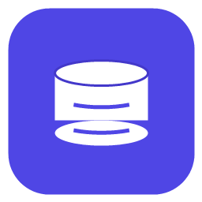

# DESIGN.md — Visual Direction

This file captures the visual direction of dbboard. It is a living
document: fill in concrete values as the UI phase progresses.

> Status: **locked (v1)** — the palette, spacing, and radius tokens below are
> implemented by the `dbboard-ui::theme` module (ADR-0056), which is the single
> source of truth; this document mirrors it. Typography is specced but bundled
> fonts land in a Phase 2 fast-follow (until then the platform system font is
> used). Update this file and the module together.

## Vibe

- **Tone**: precise, calm, developer-tool. Closer to a code editor than a
  consumer app.
- **Density**: information-dense by default, with comfortable spacing
  when content is sparse.
- **Motion**: minimal. Animations only where they communicate state
  (e.g. query running, connection status).

## Color Palette

Neutrals are tinted toward the accent (not pure grey) so the ground reads as
chosen. Each token has a **Dark** and a **Light** value; egui picks per active
theme. Values are the ones in `dbboard-ui::theme` (ADR-0056).

| Token | Role | Dark | Light |
|---|---|---|---|
| `bg.canvas` | App background (`panel_fill`) | `#0C0E14` | `#F4F5F8` |
| `bg.surface` | Panels, dialogs (`window_fill`) | `#171922` | `#FFFFFF` |
| `bg.surface.alt` | Zebra row, hover, fields | `#1E2130` | `#F0F1F5` |
| `bg.code` | Inline code (`code_bg_color`) | `#12141C` | `#FAFBFC` |
| `border` | Separators, hairlines | `#282C39` | `#E2E4EC` |
| `border.strong` | Hovered edge | `#333849` | `#D3D6E0` |
| `accent` | Primary action, links, selection | `#6366F1` | `#4F46E5` |
| `danger` | Destructive, errors | `#F87171` | `#DC2626` |
| `warning` | Caution, slow queries | `#FBBF24` | `#B45309` |
| `success` | Healthy connection, OK | `#34D399` | `#059669` |

The accent is the brand indigo from the logo (light) and a brighter sibling on
the dark ground so it keeps its punch. Semantic colours (danger/warning/
success) are a **separate axis** from the accent and never double as it; they
map onto egui's `error_fg_color` / `warn_fg_color` and are exposed as
`theme::danger(dark_mode)` / `warning` / `success` for call sites that need a
colour but only know the mode.

We offer a **Light**, **Dark**, and **Auto** (follow-OS) theme; Auto is the
default (ADR-0041). Any brand-tinted UI colour (e.g. the accent, or the
staged-edit tint in issue 0013) must be read from the active egui
`Visuals` so it holds up in both themes rather than hard-coding one RGB.

## Logo

dbboard's logo is a **white database-cylinder mark on an indigo
rounded square** — a stacked-disks "database" glyph, the same silhouette
used for the schema browser.

- **Master / source of truth**: `apps/dbboard/assets/dbboard.ico` is the
  shipped multi-resolution icon (16–256 px, PNG-based) embedded in the
  Windows `.exe` (`build.rs`) and the WiX installer (`wix/main.wxs`).
  `apps/dbboard/assets/dbboard-logo-256.png` is the 256 px master used for
  docs and for re-rendering at other sizes. Reference these files; do not
  copy the image around ad hoc.
- **Palette**: background indigo **`#4F46E5`**, mark **`#FFFFFF`**. The
  indigo is the project's `accent` colour above.
- **Shape**: rounded square (app-icon convention on Windows/macOS), so it
  reads cleanly as a taskbar / Start-menu / dock icon.
- **Origin & licence**: hand-authored for the Windows packaging work
  (ADR-0032) via a throwaway PowerShell + GDI+ script, because no image
  tooling or brand asset existed. It is **fully original** — no
  third-party, traced, or licensed artwork — so it carries **no external
  copyright encumbrance** and is covered by the project's own licence
  (MIT). Downstream users may reuse it under those terms.
- **Future polish** (optional, not required): a hand-drawn SVG master
  would scale better than the GDI+ raster; until then the 256 px PNG is
  the largest clean source.

## Typography

- **UI sans**: **Inter** (OFL) — bundled in a Phase 2 fast-follow. Until then
  the platform system font is used; the palette and spacing carry the look.
- **Code / SQL / results**: **JetBrains Mono** (OFL) — same Phase 2 bundle.
  Numeric columns use tabular figures so digits align.
- **Sizes** (egui px):
  - body: 13
  - small / hint: 11–12
  - heading: 15

## Spacing & Radius

- Base unit: **4px**. Item spacing `8×6`, button padding `10×6`, menu margin
  `6` (see `theme::apply_spacing`).
- Window / dialog / menu radius: **8px** (`window_corner_radius`).
- Widget radius (buttons, fields, rows): **6px**.

## Components (initial scope)

- **Connection list** (sidebar) — list of configured databases with
  status pills.
- **Schema browser** — tree view of tables / views / functions.
- **SQL editor** — monospace, syntax-aware where feasible.
- **Result table** — virtualised, sortable, copy-friendly.
- **Status bar** — connection health, last query timing.

Each component will get a small style spec in this file once it is built.

### Built (ADR-0057)

- **Primary button** — the one filled accent button per view, reserved for the
  view's primary action (e.g. **Run**). Accent fill, opaque `ON_ACCENT` label,
  bold. All sibling actions stay neutral secondaries. `theme::primary_button`.
- **Pill** — rounded chip at the widget radius: faint fill, hairline stroke,
  optional leading status dot. Used for the header active-connection pill and
  the sidebar table-count badge. Small text. `theme::pill`.
- **Segmented theme toggle** — inline **Auto | Light | Dark** selectable group
  in the menu bar, replacing the old dropdown. Selected segment reads active.
- **Status dot** — the pill's leading dot signals *active*, not health; there
  is no live connectivity probe, so it never claims a connection is reachable.
- **Count badge** — table-count pill on the Tables heading. Table count only;
  per-table row counts are deferred (they need a heavy per-table `COUNT(*)`).

## Layout

- Default: three-pane (sidebar / editor / results) inspired by classic
  DB clients.
- Resizable splitters with sensible minimum sizes.
- Responsive only in the sense of "behaves well at 1280×720 and up".

## Accessibility

- Respect OS font scale.
- Keyboard-first navigation for power users.
- Sufficient contrast at every theme variant (target WCAG AA).
